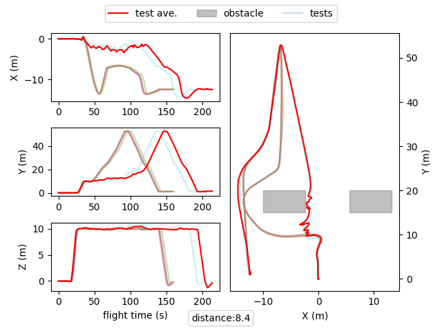

# CPS-UAV: Unmanned Aerial Vehicle Testing Competition

## Important Updates (8.12.2023)

- **Due to multiple requests, we are implementing a grace period. You can update your submissions until 10.12.2023 (AoE).**
- **In the meantime, we are checking if we can run and evaluate your submitted codes. We will let you know if we got problems and ask for an update if needed.**
- **A small update to [testcase.py](https://github.com/skhatiri/UAV-Testing-Competition/commit/50e3e983ef98f1be4a550922fc23b68b35740a4b) will also help some of you that had problems integrating latest changes.**
- **To easily set the simulation timeout, you can use the following command to run your test generator:**

  `SIMULATION_TIMEOUT=300 python3 cli.py generate case_studies/mission1.yaml 100`

## Important Updates (4.12.2023)

- **Recent [Aerialist update](https://github.com/skhatiri/Aerialist/pull/14) lets you set a timeout period for simulations. After timeout is reached, simulation is aborted and you can access the flight log and plot of the unfinished test.**
- **This can help with identifying the test cases that take too much time to finish, and before you were not able to check the logs to understand why.**

## Important Updates (28.11.2023)

- **Sumbmission Deadline is extended to 7.12.2023 (AoE).**
- **Make Sure to follow the below requirements in your submission.**

## Important Updates (21.11.2023)

- **Submission requirements and guideline is now available. [Check Here](./docs/submission.md).**
- **Make sure to review and integrate the recent updates to the [code samples](./snippets/) into your code where needed.**
- **Make sure to pull/install the latest version of [Aerialist](https://github.com/skhatiri/Aerialist).**

Unmanned Aerial Vehicles (UAVs) equipped with onboard cameras and various sensors have already demonstrated the possibility of autonomous flights in real environments, leading to great interest in various application scenarios: crop monitoring, surveillance, medical and food delivery.

Over the years, support for UAV developers has increased with open-access projects for software and hardware such as the autopilot support provided by [PX4](https://github.com/PX4/PX4-Autopilot) and [Ardupilot](https://github.com/ArduPilot/ardupilot).
However, despite the necessity of systematically testing such complex and automated systems to ensure their safe operation in real-world environments, there has been relatively limited investment in this direction so far.

The UAV Testing Competition organized by the [Search-Based and Fuzz Testing (SBFT) workshop](https://sbft24.github.io/) is an initiative designed to inspire and encourage the Software Testing Community to direct their attention toward UAVs as a rapidly emerging and crucial domain.

## Table of Contents

- [Competition Overview](#overview)
- [Goal](#goal)
- [Competition Platform](#competition-platform)
  - [Software Under Test](#software-under-test)
  - [Aerialist](#aerialist-uav-test-bench)
- [Test Generation](#test-generation)
  - [UAV Test Cases](#uav-test-cases)
  - [Case Studies](#case-studies)
  - [UAV Test Generators](#uav-test-generators)
- [Competition Guideline](#competition-guideline)
  - [Submission](#submission)
  - [Evaluation](#evaluation)
  <!-- - [Baselines](#baselines) -->
- [References](#references)
- [License](#license)
- [Contacts](#contacts)
  
## Overview

Multiple studies have proven that many UAV bugs can be potentially detected before field tests if proper simulation-based testing is in place. This suggests the need for further research on setting up simulation environments that test UAVs' behavior in diverse, complex, and realistic scenarios.

However, the *engineering complexity* of UAVs and their test environments, and the difficulty of setting up *realistic-enough* simulation environments that can capture the same bugs as physical tests represent relevant obstacles.

In the first edition of the UAV Testing Competition, we aim to provide software testing researchers with a simple platform to facilitate their onboarding in the UAV domain. Using the provided platform and case study, the goal is to use search-based techniques for generating challenging test cases for autonomous vision-based UAV navigation systems.

- The [Software Under Test](#software-under-test) is [PX4-Avoidance](https://github.com/PX4/PX4-Avoidance), a vision-based autonomous obstacle avoidance system developed on top of [PX4-Autopilot](https://github.com/PX4/PX4-Autopilot).

- We create challenging scenarios for PX4-Avoidance by placing static obstacles on the UAV's path.
- The ultimate goal is to find some specific obstacle configurations (size, position) that could lead to a crash or unsafe flight by the autopilot, as seen in the below image.

<p align="center"></p>

## Goal

In the tool competition, each participant presents a robust test generator capable of generating a diverse set of tests.
The primary objective is to find potential vulnerabilities within the PX4 obstacle avoidance system.
This involves manipulating obstacle sizes and placements within the test environment,
with the ultimate goal of either causing the UAV to crash or significantly diverting it from its intended path.

The goals of the tool competition are as below:

- The objective is to develop a test generator capable of creating diverse and effective tests to uncover
vulnerabilities within the PX4 avoidance system.
- The generated test will be for a predefined UAV firmware, model, and mission.
- The generated test will create a challenging environment by manipulating object sizes and placements to cause
either UAV crashes or significant deviations in its flight path.

The effectiveness of these generated tests will be measured based on the number of failed cases and the diversity of
test scenarios. The goal is to identify potential system weaknesses comprehensively.

## Competition Platform

### Software Under Test

- **[PX4](https://github.com/PX4/PX4-Autopilot)** :
PX4 is an open-source autopilot software stack primarily used for controlling unmanned aerial vehicles(UAVs).
It provides a flexible and customizable platform for designing and controlling the drones, including capabilities for navigation, stabilization, and mission planning.
PX4 is compatible with various hardware platforms and is widely used in both academic and commercial drone applications.
It supports a range of UAV types, from small quadcopters to fixed-wing aircraft and even VTOL (Vertical Take-Off and Landing) vehicles.
Developers and researchers often use PX4 as a foundation for creating and testing new drone capabilities and applications.

- **[PX4 Avoidance](https://github.com/PX4/PX4-Avoidance)** :
PX4 Avoidance is a software module in the PX4 Autopilot ecosystem that provides obstacle detection and avoidance capabilities.
PX4 Avoidance uses various sensors and algorithms to help UAVs navigate and avoid obstacles in their environment. It allows UAVs to detect obstacles such as buildings, trees, and other objects in their flight path and make adjustments to their flight path to avoid collisions or navigate around these obstacles safely.
Overall, PX4 Avoidance is a critical component for ensuring the safe and reliable operation of UAVs in complex and dynamic environments.

- **[PX4 Flight Logs](https://docs.px4.io/main/en/log/flight_log_analysis.html)**:
PX4 flight logs are comprehensive records of a drone's operational data and telemetry during its flights. These logs include detailed information such as GPS coordinates, altitude, motor RPM, sensor data, and flight modes. They are invaluable for troubleshooting, performance analysis, and debugging, as they allow developers and operators to examine precisely what happened during a flight, identify potential issues, and fine-tune the drone's behavior and systems for optimal performance and safety. These logs are stored in a standardized format (.ulg), making them compatible with various analysis and visualization tools for in-depth technical examination. [Here is a sample flight log](https://logs.px4.io/plot_app?log=f986a896-c189-4bfa-a11a-1d80fa4b9633).

- **[Gazebo](https://gazebosim.org/home)** :
Gazebo is an open-source 3D robot simulator that provides a realistic and physics-based simulation environment for testing and validating UAVs and robotic systems.
PX4 often utilizes Gazebo as a simulation platform to create virtual environments where developers and researchers can test UAVs without the need for physical hardware. This allows for various scenarios, including flight testing, obstacle avoidance, and mission planning, to be tested in a safe and controlled virtual environment.
Gazebo simulates the physical properties and dynamics of the UAV and its surroundings, including sensors, wind, and terrain. It is a valuable tool for both software and hardware development, as it enables testing and debugging of UAV control algorithms and systems before deploying them to actual UAV hardware.

### Aerialist: UAV Test Bench

[Aerialist](https://github.com/skhatiri/Aerialist) (unmanned AERIAL vehIcle teST bench) is a novel test bench for UAV software that automates all the necessary UAV testing steps: setting up the test environment, building and running the UAV firmware code, configuring the simulator with the simulated world properties, connecting the simulated UAV to the firmware and applying proper UAV configurations at startup, scheduling and executing runtime commands, monitoring the UAV at runtime for any issues, and extracting the flight log file after the test completion.

With Aerialist, we aim to provide the competition participants with an easy platform to automate tests on the simulated UAVs, allowing them to do experiments required to overcome the UAV simulation-based testing challenges.
**The Test Generators submited to the competition are required to build on top of Aerialist to simplify the evaluation process.**
Check [Aeialist's Documentation](https://github.com/skhatiri/Aerialist) for more details on the usage.  

## Test Generation

Competition participants are expected to submit a [Test Generator](#uav-test-generators) that generates challenging [test cases](#uav-test-cases) for a given [case study](#case-studies).

### UAV Test Cases

Aerialist models a UAV test case with the following set of *test properties* and uses a *YAML* structure to describe the test.

- **Drone**: Software configurations of the UAV model, including all [Autopilot parameters](https://docs.px4.io/main/en/advanced_config/parameter_reference.html) and configuration files (e.g., mission plan) required to set up the drone for the test.

- **Environment**: Simulation settings such as the used simulator, physics of the simulated UAV, simulation world (e.g., surface material, UAV’s initial position), surrounding objects (e.g., obstacles size, position), weather conditions (e.g., wind, lighting), etc.

- **Commands**: Timestamped external commands from the ground control station (GCS) or the remote controller (RC) to the UAV during the flight (e.g., change  flight mode, go in a specific direction, enter mission mode).

- **Expectation (optional)**: a time series of certain sensor readings that the test flights are expected to follow closely.

Using a predefined [test-description yaml file](snippets/case_studies/) is the easiest way to define the test case.

```yaml
# mission2.yaml
drone:
  port: ros #{sitl, ros, cf}
  params_file: case_studies/mission-params.csv 
  mission_file: case_studies/mission2.plan

simulation:
  simulator: ros #{gazebo, jmavsim, ros} 
  speed: 1
  headless: true
  # obstacles:
  # - size:
  #     l: 10
  #     w: 5
  #     h: 20
  #   position:
  #     x: 10
  #     y: 20
  #     z: 0
  #     r: 0
  # - size:
  #     l: 10
  #     w: 5
  #     h: 20
  #   position:
  #     x: -10
  #     y: 20
  #     z: 0
  #     r: 0

test:
  commands_file: case_studies/mission-commands.csv
```

<p align="center"></p>

**The competition Test Generators are only allowed to manipulate the obstacles in the environment.**
For simplicity, we only consider box-shaped obstacles.
An obstacle is defined by its size (length, width, height) and position in the simulation environment (x,y,z) in meters and its rotation angle in degrees.

```yaml
# mission2.yaml
simulation:
  simulator: ros #{gazebo, jmavsim, ros} 
  speed: 1
  headless: true
  obstacles:
  - size:
      l: 10
      w: 5
      h: 20
    position:
      x: 10
      y: 20
      z: 0
      r: 0
  - size:
      l: 10
      w: 5
      h: 20
    position:
      x: -10
      y: 20
      z: 0
      r: 0
```

The below image shows the drone flight trajectory during the execution of the above test case:

<p align="center"></p>

### Case Studies

The input to the test generators are some simple test cases, without any obstacles in the simulation environment.
These case studies include a predefined flight mission, relevant drone configurations, simulation configurations, and relevant commands to start the autonomous mission.

The test generators are then expected to place obstacles in the simulation environment, inside a predefined area.

There have been a few [**sample case studies**](./snippets/case_studies/) (similar to the above scenarios) provided to help you develop your test generators.
Some other similar case studies will be used for evaluation.

<!-- [mission2.yaml](snippets/case_studies/mission2.yaml):

1. Taking off
2. Heading forwrd towards the 1st waypoint point in about 50 meters ahead.
3. Heading back towards the landing point in about 10 meters to the left of the take off position.
4. Landing

```yaml
drone:
  port: ros #{sitl, ros, cf}
  params_file: case_studies/mission-params.csv 
  mission_file: case_studies/mission2.plan

simulation:
  simulator: ros #{gazebo, jmavsim, ros} 
  speed: 1
  headless: true
#   obstacles:
#   - size:
#       l: 10
#       w: 5
#       h: 20
#     position:
#       x: 10
#       y: 20
#       z: 0
#       r: 0
#   - size:
#       l: 10
#       w: 5
#       h: 20
#     position:
#       x: -10
#       y: 20
#       z: 0
#       r: 0

test:
  commands_file: case_studies/mission-commands.csv

``` -->

<!-- <p align="center"></p> -->

### UAV Test Generators

Given a simulated test case configuration for autonomous flight (above-mentioned case studies), the goal is to generate a more challenging simulated test case by introducing obstacles to the environment, to force the UAV to get too close to the obstacles (\ i.e. having a distance below a predefined safety threshold) while still completing the mission.
This will create a risky environment for the UAV to operate the mission.

Participants are expected to use search-based methods to find challenging obstacle configurations.
The generated test cases (following the Aerialist test case modeling) should respect the following considerations:

- The drone is expected to **safely** avoid all the obstacles on its path. This includes maintaining a safe distance from the surrounding obstacles and not crashing into them.
  - A test execution is considered a **Hard Fail** if there is a collision with any of the obstacles in the environment.
  - A test execution is considered a **Soft Fail** if the drone does not maintain a minimum safe distance of **1.5 m** to the surrounding obstacles.

- The obstacle configurations are expected to keep the flight mission physically feasible.
  - The test cases that make it impossible for the UAV to find its path (e.g., creating a long wall among the drone path) while there is no hard or soft fail are considered **Invalid**.

- All the obstacles are expected to **fit in a given rectangular area** as stated in the case study.

- There can be **up to 4 obstacles** in each test case.

- Obstacles **must not collide** with each other, and they must be placed directly on the ground (z=0).

A sample test generator using a random approach is documented and made available [here](./snippets/)
<!-- 
* ***[Surrealist](https://github.com/skhatiri/Surrealist)*** : It is a tool that provides a search-based Test 
generation approach for UAV software. It provides an implementation for different testing goals like replication of 
real-world tests in simulation, generating non-deterministic test cases, and generating more challenging test cases
based on a given test. This tool internally uses Aerialist to evaluate the test cases. -->

## Competition Guideline

### Submission

Follow the [Submission Guideline](./docs/submission.md), prepare your code as explained and send it to the organization committee.

- **Submission Deadline**: 7.12.2023 (extended)

### Evaluation

The efficacy of the test generators will be assessed based on two crucial metrics: the number of failed cases
and the diversity of the test scenarios.
The first metric, the number of failed cases, serves as a straightforward
indicator of the test's ability to uncover system weaknesses. A higher number of failures signifies a more effective test generator in this context.

However, it is equally essential to consider the diversity of test cases.
Diversifying the test scenarios is critical as it helps ensure that a wide spectrum of potential vulnerabilities is
explored. The more varied the test cases, the greater the likelihood of identifying hidden flaws and edge cases that
might otherwise go undetected.

The following metrics will be used to evaluate the tests generated by the tools developed:

- Fault Detection (Test Failure): The test cases will be evaluated for fault detection.
- Testing Budget: A testing budget will be allocated for generating the test cases.
- Test Diversity: Diversity in the test will be valued more.
- Simplicity: Faults found in less complicated environments (fewer obstacles) will be valued more.

<!-- ***In order to rank the generated tests, We will run 10 times the final test for evaluation
Fault Detection Probability.***

- Tools are allocated a predetermined budget for test execution. This budget represents the overall count of simulated
test executions.

- When a single test case is concurrently simulated 5 or 10 times, it draws upon 5 or 10 executions from the budget.

- Developers hold the responsibility for optimizing their utilization of this allocated budget. -->

<!-- ### Baselines

To establish a baseline for evaluating the test generators, [Surrealist](https://github.com/skhatiri/surrealist) will be employed.
The test cases generated by the competitors will be evaluated against the tests generated by Surrealist.

Surrealist, serving as the benchmark test generator, will provide a reference point against which the competitors' test cases can be compared.
This ensures a fair and comprehensive evaluation of the generated tests, allowing for a well-informed assessment of their quality and effectiveness in identifying vulnerabilities within the PX4 avoidance system. -->

## References

If you use this tool in your research, please cite the following papers:

- **Sajad Khatiri**, Sebastiano Panichella, and Paolo Tonella, "Simulation-based Test Case Generation for Unmanned Aerial Vehicles in the Neighborhood of Real Flights," *In 2023 IEEE 16th International Conference on Software Testing, Verification and Validation (ICST)*
  - [Preprint](https://skhatiri.ir/papers/surrealist.pdf)

````{code-block} bibtex
@inproceedings{khatiri2023simulation,
  title={Simulation-based test case generation for unmanned aerial vehicles in the neighborhood of real flights},
  author={Khatiri, Sajad and Panichella, Sebastiano and Tonella, Paolo},
  booktitle={2023 16th IEEE International Conference on Software Testing, Verification and Validation (ICST)},
  year={2023},
}
````

## License

The software we developed is distributed under MIT license. See the [license](./LICENSE.md) file.

## Contacts

Feel free to use the [Discussions](https://github.com/skhatiri/UAV-Testing-Competition/discussions) section to ask your questions and look for answers.

You can also contact us directly using email:

- Sajad Khatiri (Zurich University of Applied Sciences) - <mazr@zhaw.ch>
- Prasun Saurabh (Zurich University of Applied Sciences) - <sarr@zhaw.ch>
- Timothy Zimmermann (Verity) - <timothy.zimmermann@outlook.com>
- Charith Munasinghe (Zurich University of Applied Sciences) - <mung@zhaw.ch>
- Christian Birchler (Zurich University of Applied Sciences) - <birc@zhaw.ch>
- Dr. Sebastiano Panichella (Zurich University of Applied Sciences) - <panc@zhaw.ch>
