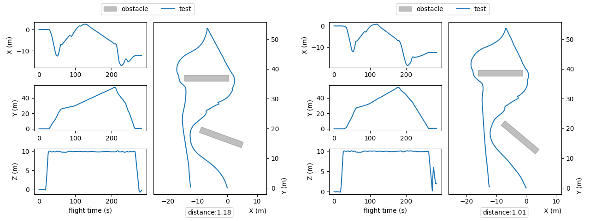

# UAV Testing Competition

## Description
This repository contains the implementation for the [UAV Testing Competition](https://conf.researchr.org/track/icst-2025/icst-2025-tool-competition--uav-testing), which challenges participants to create and evaluate efficient test scenarios for Unmanned Aerial Vehicles (UAVs).

This project implements a test case generation algorithm using advanced techniques such as `Evolution Strategies`, specifically the `EE-(1+1) algorithm`, which iteratively evolves solutions to minize the distance and diversity of the test cases. Additionally, a `Fibonacci Spiral Point Selection methodology` is used to optimize the distribution of points, ensuring uniform coverage in testing scenarios.



## Repository Structure

```python
📦 name/
├── 📁 docs/ # Documentation
├── 📁 reports/ # Competition Report 2024
├── 📁 snippets/ # Scripts
│   ├── 📄 Dockerfile
│   ├── 📄 requirements.txt 
│   ├── 📄 config.py
│   ├── 📄 cli.py 
│   ├── 📄 evolution_strategy.py
│   ├── 📄 obstacle_generator.py
│   ├── 📄 fibonacci_spiral.py
│   ├── 📄 manual_testing.py
│   ├── 📄 mission_plan.py
│   ├── 📄 README.md
│   ├── 📄 testcase.py
│   └── 📄 utils.py
│   └── 📁 case_studies/ # Drone mission plans
│       ├── 📄 mission1.yaml 
│       ├── 📄 ... 
│       └── 📄 missionN.yaml 
├── 📄 README.md
└── 📄 LICENSE
```

## Environment Setup
To ensure compatibility and reproducibility, this project requires Docker (tested on version 27.3.1). Follow the steps below to set up the environment.

1. Clone the Repository

Clone the repository to your local machine:
```bash
git clone https://github.com/se-fbk/UAV-Testing-Competition.git
```

2. Build the Docker Image

Navigate to the `snippets` directory and build the Docker image:
```bash
cd name/snippets/
docker build -t name .
```

3. Run the Docker Container
Run the Docker container with the required volumes

```bash
xhost +
docker run --env DISPLAY=$DISPLAY \
    -v "/tmp/.X11-unix:/tmp/.X11-unix:rw" \
    -v "$(pwd):/src/generator" \
    -it name bash

```

## Usage

In the `config.py` file, you can modify the parameters used by the generator, such as the length and width of obstacles or the size of the Fibonacci spiral.

To start the generation, use the following command:
```python
python3 cli.py generate [mission] [budget]
```
For example:
```python
python3 cli.py generate case_studies/mission1.yaml 10
```
This will execute 10 test cases.

The results will be saved in the automatically generated folder: `/snippets/generated-test`.

## Contributors

| **Name**                | **Email**          | **Affiliation**          |
|-------------------------|--------------------|--------------------------|
| Pietro Lechthaler       | plechthaler@fbk.eu | Fondazione Bruno Kessler, Trento, Italy |
| Davide Prandi           | prandi@fbk.eu      | Fondazione Bruno Kessler, Trento, Italy |
| Fitsum Meshesha Kifetew | kifetew@fbk.eu     | Fondazione Bruno Kessler, Trento, Italy |