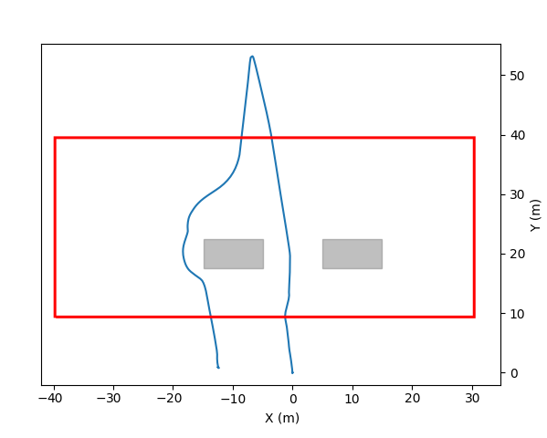
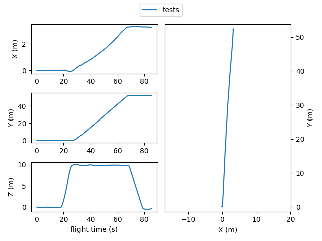
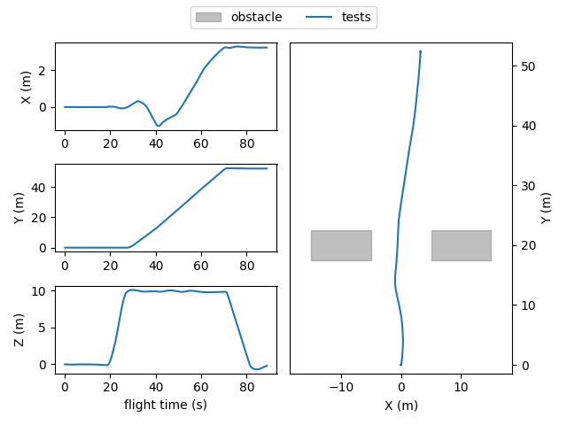
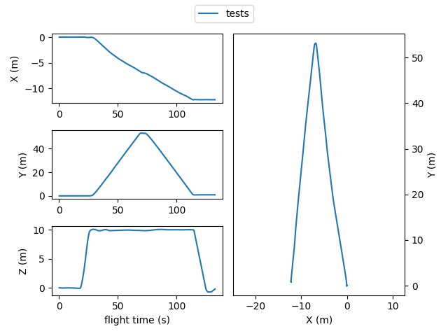
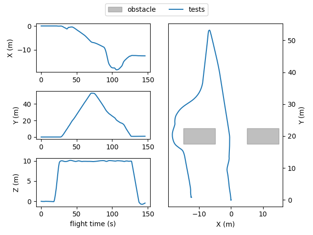
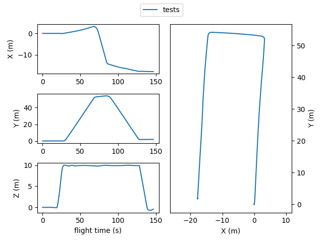
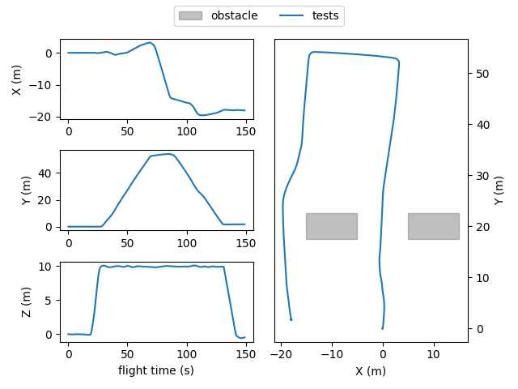

# Case Studies

The input to the test generators are some simple test cases, without any obstacles in the simulation environment.
These case studies include a predefined flight mission, relevant drone configurations, simulation configurations, and relevant commands to start the autonomous mission.

The test generators are then expected to place obstacles in the simulation environment, inside a predefined area as shown in the below image. **For simplicity, we keep this area fixed for all the case studies (-40<x<30, 10<y<40).**



Following, there are some sample case studies. you can find their 'YAML' files, as well as sample flight logs in this folder. 
For each case study, the flight trajectory for two settings are ploted as examples: first withouth any obstacles, and then with two sample obstacles.
These case studies are provided here to help you develop your test generators.
Some other similar case studies will be used for the evaluation.

## Case Study 1

[mission1.yaml](./mission1.yaml):

1. Taking off
2. Heading forwrd towards the landing point in about 50 meters ahead.
3. Landing

```yaml
drone:
  port: ros #{sitl, ros, cf}
  params_file: case_studies/mission-params.csv 
  mission_file: case_studies/mission1.plan

simulation:
  simulator: ros #{gazebo, jmavsim, ros} 
  speed: 1
  headless: true
#   obstacles:
#   - size:
#       l: 10
#       w: 5
#       h: 20
#     position:
#       x: 10
#       y: 20
#       z: 0
#       r: 0
#   - size:
#       l: 10
#       w: 5
#       h: 20
#     position:
#       x: -10
#       y: 20
#       z: 0
#       r: 0

test:
  commands_file: case_studies/mission-commands.csv

```

<p align="center"></p>

## Case Study 2

[mission2.yaml](./mission2.yaml):

1. Taking off
2. Heading forwrd towards the 1st waypoint point in about 50 meters ahead.
3. Heading back towards the landing point in about 10 meters to the left of the take off position.
4. Landing

```yaml
drone:
  port: ros #{sitl, ros, cf}
  params_file: case_studies/mission-params.csv 
  mission_file: case_studies/mission2.plan

simulation:
  simulator: ros #{gazebo, jmavsim, ros} 
  speed: 1
  headless: true
#   obstacles:
#   - size:
#       l: 10
#       w: 5
#       h: 20
#     position:
#       x: 10
#       y: 20
#       z: 0
#       r: 0
#   - size:
#       l: 10
#       w: 5
#       h: 20
#     position:
#       x: -10
#       y: 20
#       z: 0
#       r: 0

test:
  commands_file: case_studies/mission-commands.csv

```

<p align="center"></p>

## Case Study 3

[mission3.yaml](./mission3.yaml):

1. Taking off
2. Heading forwrd towards the 1st waypoint point in about 50 meters ahead.
3. Heading about 20m to the left to the second way point.
4. Heading back towards the landing point in about 20 meters to the left of the take off position.
5. Landing

```yaml
drone:
  port: ros #{sitl, ros, cf}
  params_file: case_studies/mission-params.csv 
  mission_file: case_studies/mission3.plan

simulation:
  simulator: ros #{gazebo, jmavsim, ros} 
  speed: 1
  headless: true
#   obstacles:
#   - size:
#       l: 10
#       w: 5
#       h: 20
#     position:
#       x: 10
#       y: 20
#       z: 0
#       r: 0
#   - size:
#       l: 10
#       w: 5
#       h: 20
#     position:
#       x: -10
#       y: 20
#       z: 0
#       r: 0

test:
  commands_file: case_studies/mission-commands.csv

```

<p align="center"></p>